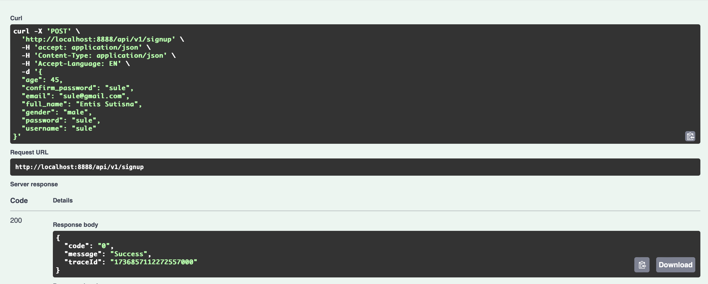
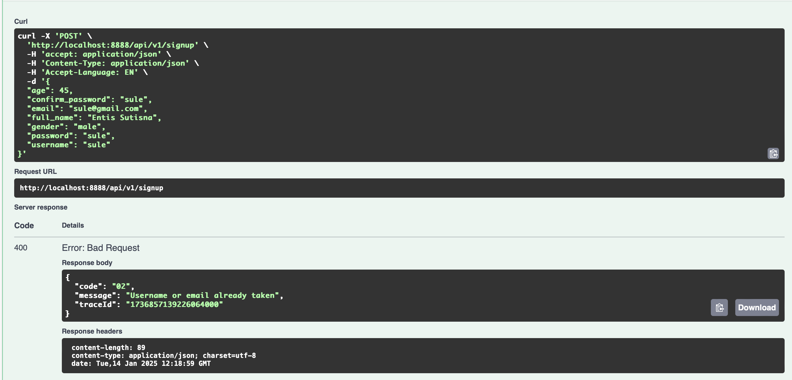
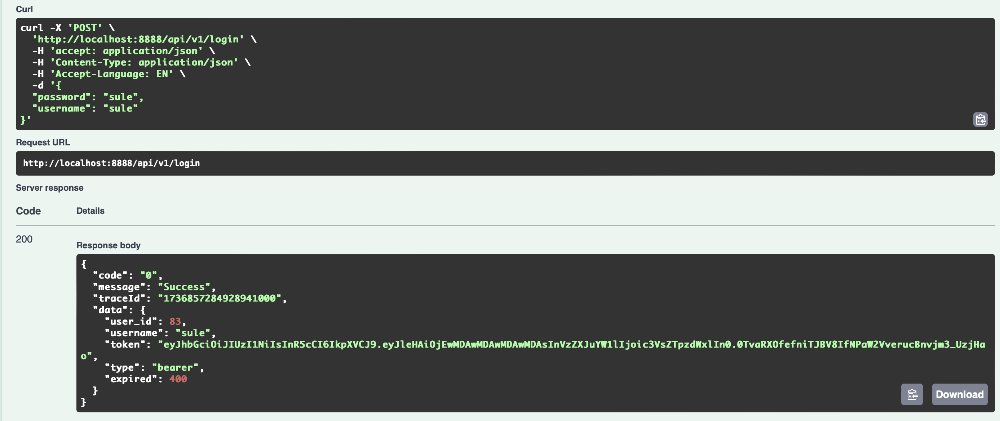
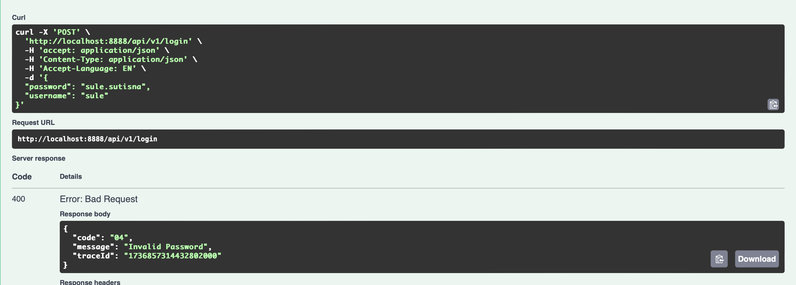
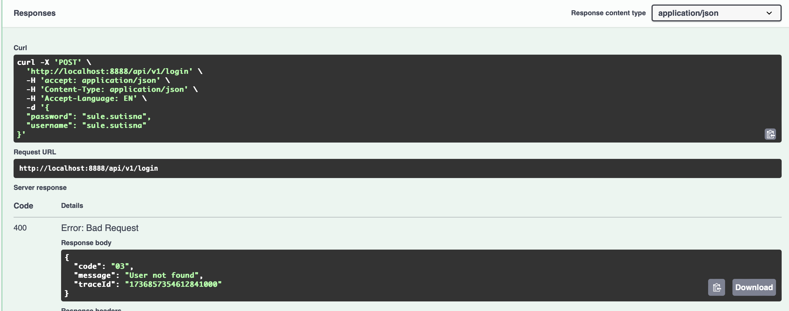
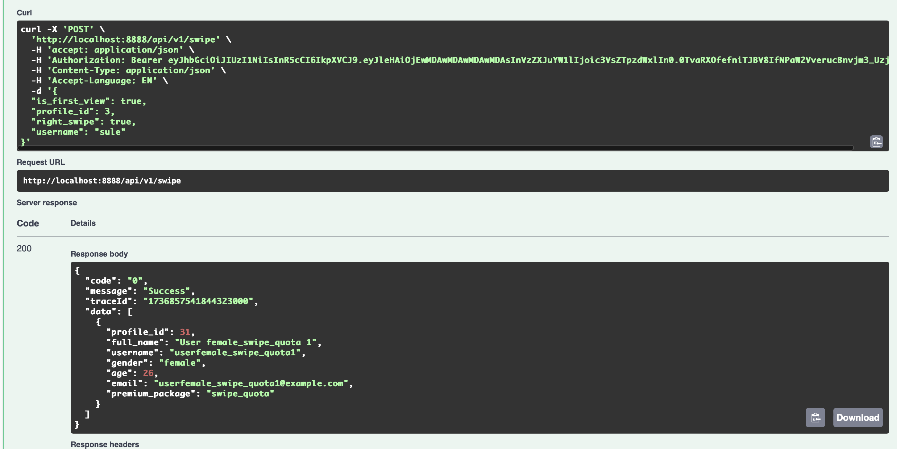
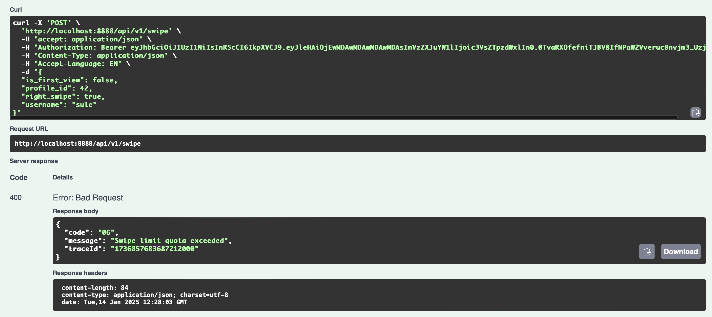

# Dating Backend

This repository contains the backend code for a dating application. It is designed to handle user management, matchmaking, and other core functionalities.

## Table of Contents

- [Project Structure](#project-structure)
- [Running the Application](#running-the-application)
- [Unit Testing and Integration Testing](#unit-testing-and-integration-testing)
- [Postman Testing](#postman-testing)
- [Additional Enhancement](#contribution-guidelines)

## Project Structure

```plaintext
.
├── app
│   ├── controller        # Handles API requests and responses
│   ├── domain
│   │   ├── contract      # Interfaces and abstractions
│   │   ├── models        # Data models
│   │   ├── types         # Domain-specific types
│   ├── helper            # Utility functions
│   ├── repository        # Database interaction layer
│   ├── service           # Business logic layer
│   ├── usecase           # Application use cases
├── common                # Shared resources
├── docs                  # Swagger files
├── infra                 # Infrastructure-related code (database, server setup)
├── log                   # Logging setup
├── seeder                # Database seeders
├── test                  # Unit Test and Integration Test
├── config.toml           # Configuration file
├── docker-compose.yml    # Docker Compose file
├── Dockerfile            # Docker build file
├── go.mod                # Go module definition
├── main.go               # Entry point of the application
└── messages.json         # JSON file for application messages
```

## Running the Application
```plaintext
 I use docker to deploy the backend service, please make sure you have docker in your machine
  the all things already put it in docker-compose.yml you just typing
```
```code
docker-compose up -d
```

## Unit Testing and Integration Testing
```code
go to directory test (cd test)
and typing go test ./... -v
```

## Postman Testing
## Signup Success

## Signup Failed

## Login Success

## Signup Failed 1

## Signup Failed 2

## Swipe Success

## Swipe Success 1


## Additional Enhancement
## Enhancements
```

-- Swagger --
1. You can use swagger just visit the
    http://localhost:8888/swagger/index.html#/
  
-- Redis Integration --
1. Redis is used for caching and swipe api handling.
2. Make sure to configure Redis in config.toml file.

-- Log Tracing --
1. The application includes a log tracer to monitor the flow of requests and responses.
2. Each step in the flow is logged with its duration for performance tracking and debugging.
3. You can see the log folder in folder log
```

# dating-be
# dating-be
